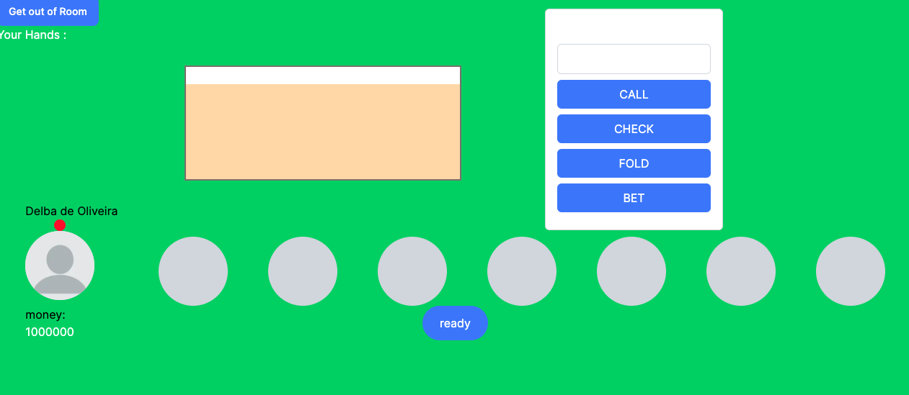

# NextPoker

Welcome to NextPoker, where you can enjoy a thrilling game of poker with your friends through this web application!



## Getting Started

To get started with NextPoker, you'll need to set up a few things:

1. **Install Dependencies**: Make sure you have the following installed:

   - RDBS (PostgreSQL recommended)
   - Redis DB
   - npm

2. **Environment Configuration**: Create a `.env` file in the root directory of the project (`NEXTJS-POKER`). Populate it with the necessary environment variables:

   ```plaintext
   AUTH_SECRET="GENERATE A STRONG SECRET"

   POSTGRES_USER="YOUR_POSTGRES_USER"
   POSTGRES_HOST="YOUR_POSTGRES_HOST"
   POSTGRES_DATABASE="YOUR_POSTGRES_DATABASE"
   POSTGRES_PASSWORD="YOUR_POSTGRES_PASSWORD"
   POSTGRES_PORT="YOUR_POSTGRES_PORT"

   REDIS_PW="YOUR_REDIS_PASSWORD"
   REDIS_HOST="YOUR_REDIS_HOST"
   REDIS_PORT="YOUR_REDIS_PORT"
   ```

3. **Database Initialization**: Run the seed file to create the initial database tables and data:

   ```bash
   npm run seed
   ```

4. **Run the Server**: Start the NextPoker server in development mode:

   ```bash
   npm run dev
   ```

## Contributing

We welcome contributions to NextPoker! If you'd like to add new features or enhance the user interface, here's how you can contribute:

1. **Discuss Your Idea**: Before you start working on a new feature, it's a good idea to discuss it with us. Create an issue on GitHub to let us know what feature you're considering.

2. **Make Your Changes**: Once you have a green light, make the necessary changes to the codebase.

3. **Submit a Pull Request**: After making your changes, submit a pull request. We'll review your code and merge it if everything looks good.

4. **Stay in Touch**: Communication is key! Feel free to reach out if you have any questions or need further guidance.

## Current Development

We're currently focused on enhancing the NextPoker experience. Check out our GitHub repository for the latest updates and to see what features we're working on.
